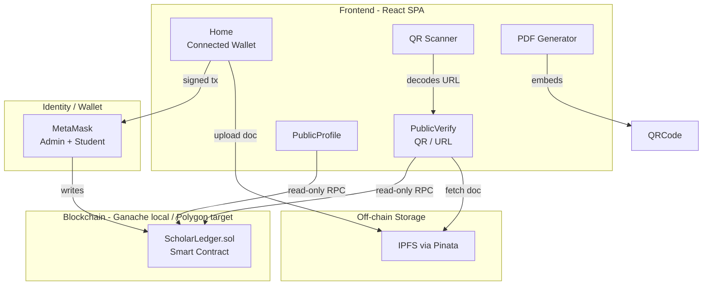
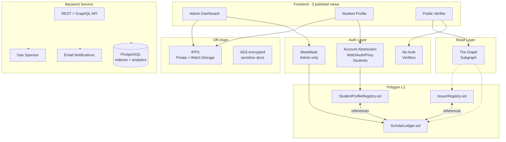
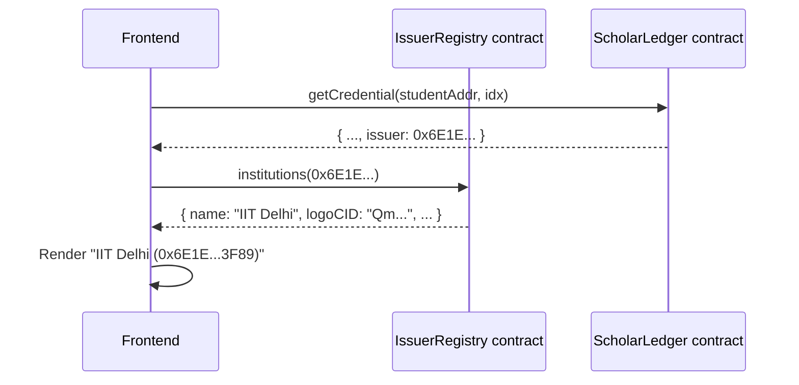
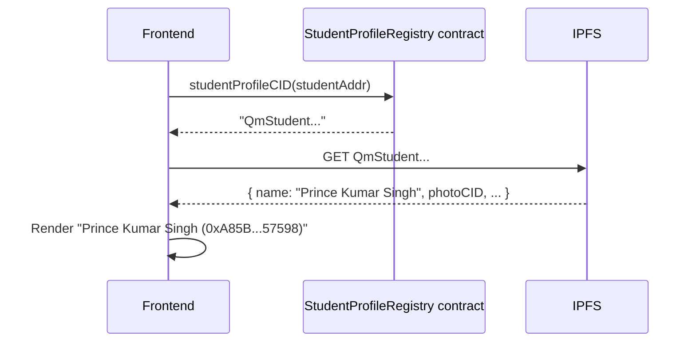
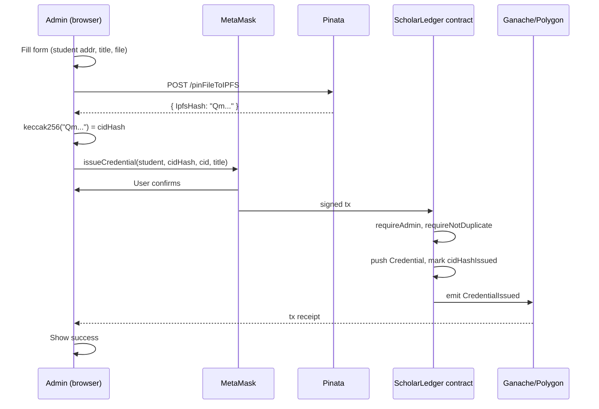
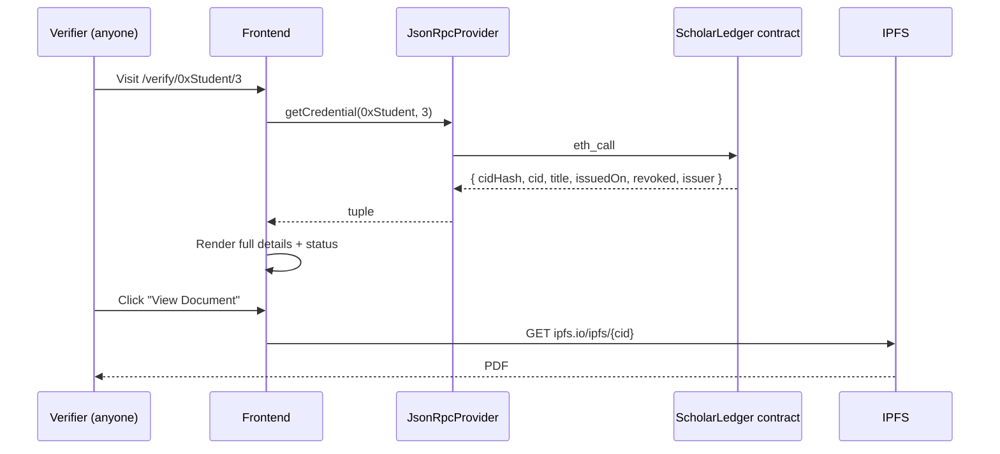
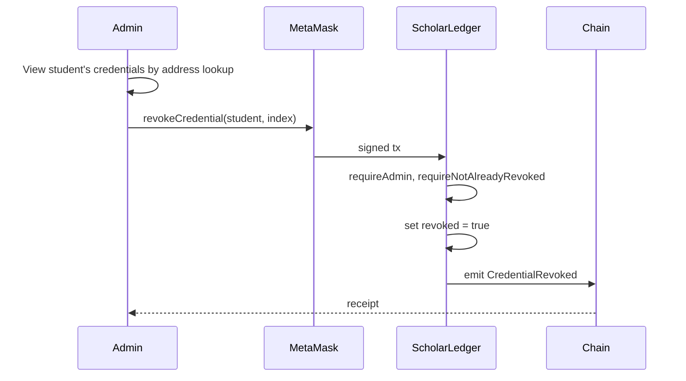
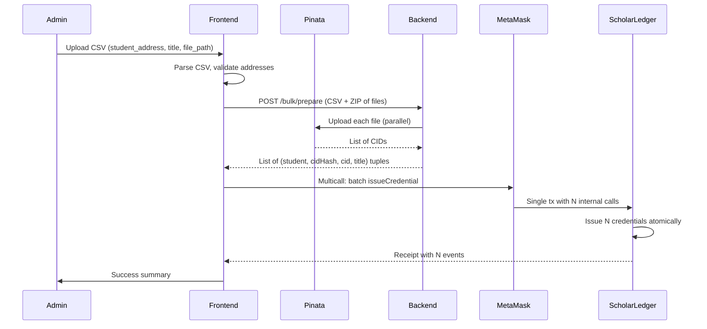
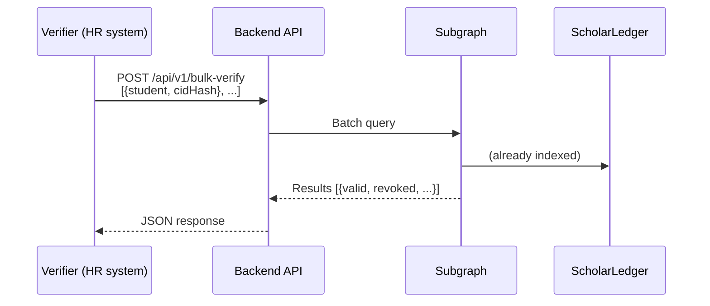

# Scholar Ledger — System Architecture Document

**Version:** 1.0
**Last Updated:** 2026-05-04
**Status:** Living document — updated as the system evolves
**Project Type:** B.Tech Final-Year Major Project

---

## Table of Contents

1. [Executive Summary](#1-executive-summary)
2. [Project Vision and Goals](#2-project-vision-and-goals)
3. [Stakeholders and User Roles](#3-stakeholders-and-user-roles)
4. [High-Level Architecture](#4-high-level-architecture)
5. [Component Specifications](#5-component-specifications)
6. [Data Models](#6-data-models)
7. [Identity Layer — Human-Readable Names](#7-identity-layer--human-readable-names)
8. [Data Flow Diagrams](#8-data-flow-diagrams)
9. [Authentication and Authorization](#9-authentication-and-authorization)
10. [Security Model](#10-security-model)
11. [Privacy and Compliance Model](#11-privacy-and-compliance-model)
12. [Deployment Topology](#12-deployment-topology)
13. [Technology Stack](#13-technology-stack)
14. [Implemented Features (Phase 1 Complete)](#14-implemented-features-phase-1-complete)
15. [Pending Features](#15-pending-features)
16. [Industry Comparison and Gap Analysis](#16-industry-comparison-and-gap-analysis)
17. [Phased Roadmap](#17-phased-roadmap)
18. [Open Decisions Required](#18-open-decisions-required)
19. [Glossary](#19-glossary)

---

## 1. Executive Summary

**Scholar Ledger** is a decentralized academic credential system that lets universities issue tamper-proof digital credentials and lets anyone — students, employers, other institutions — verify them publicly without intermediaries.

The system separates two concerns:
- **Storage** of the actual document (a PDF degree, transcript, etc.) lives on **IPFS** — a content-addressed, distributed file system.
- **Verification** lives on the **Ethereum blockchain** — a public smart contract stores a cryptographic hash of every credential, the issuer's wallet address, the student's wallet address, and a revocation flag.

To verify a credential, a third party hashes the document and checks the chain. If the hash matches an active (non-revoked) entry, the credential is authentic.

The frontend (React) provides three experiences in one app:
- **Admin (university)** — issues and revokes credentials with a MetaMask wallet
- **Student** — views own credentials, downloads PDFs, shares profile links and per-credential QR codes
- **Verifier (employer/anyone)** — verifies via QR scan, public URL, or manual form — **no wallet, no signup**

### Why this matters

Academic fraud affects 20% of job applications globally. Manual verification (calling registrars, mailing transcripts) is slow, expensive, and easily bypassed. Systems like MIT Blockcerts, the EU's EBSI, and India's IGNOU initiative have proven blockchain-anchored credentials are practical at scale. Scholar Ledger applies the same pattern to a single-institution deployment, with the architectural runway to expand.

---

## 2. Project Vision and Goals

### 2.1 Vision

> A world in which a degree, certificate, or skill badge can be verified by anyone, anywhere, in seconds, without trusting any centralized authority — and where the holder owns and controls their own credentials forever.

### 2.2 Primary Goals

| # | Goal | Why it matters |
|---|------|----------------|
| G1 | Tamper-proof issuance | A credential, once issued, cannot be silently altered |
| G2 | Public verifiability without an account | Verifiers (recruiters, governments) shouldn't need to install MetaMask or sign up |
| G3 | Long-lived credentials | The credential outlives the issuing software — works as long as the chain exists |
| G4 | Issuer-controlled revocation | Universities can revoke fraudulent or mistaken credentials |
| G5 | Document portability | Holder can email, print, or QR-share the credential anywhere |
| G6 | Privacy-preserving identity | Personal data stays off-chain; only hashes are public |

### 2.3 Non-Goals (explicit)

| # | Non-Goal | Why excluded |
|---|----------|--------------|
| NG1 | Run on Ethereum mainnet | Gas costs are prohibitive for academic use; Polygon is target |
| NG2 | Replace university SIS / ERP systems | Scholar Ledger is the verification layer, not the system of record |
| NG3 | Issue physical-asset NFTs | Credentials are non-transferable (soulbound semantics) |
| NG4 | Support arbitrary credential types in v1 | We focus on academic credentials; medical, KYC, etc. are future-work |

---

## 3. Stakeholders and User Roles

| Role | Who | Wallet? | Auth method | Primary actions |
|------|-----|---------|-------------|-----------------|
| **University Admin** | Registrar / Department head / Faculty (small group) | Yes — MetaMask | Wallet signature | Issue, revoke, transfer admin |
| **Student** | The credential holder | Yes (eventually wallet-less via Account Abstraction) | Wallet signature today; email + passkey in Phase 2 | View own credentials, download PDF, share profile, generate QR |
| **Verifier** | Employer, government agency, another university, anyone | **No** | None — public read | Verify a credential by URL, QR, or manual form |
| **Accreditation Body (future)** | UGC / AICTE / Govt body | Yes | Wallet signature | Approve which addresses can be Issuers in the trust registry |

The **tiered authentication model** is core to adoption: matching auth complexity to actual user needs is what makes the system usable beyond Web3-natives.

---

## 4. High-Level Architecture

### 4.1 Current State (Phase 1 complete)



### 4.2 Target Architecture (production)



### 4.3 Architectural Principles

1. **Public verifiability is non-negotiable.** Any verifier must be able to confirm a credential without an account, install, or signup. This drives the read-only RPC and the public route design.
2. **Trust the chain, augment with off-chain layers.** The chain is the ledger of record. Backend, indexer, and database are caches — they can be rebuilt from chain events.
3. **Smart contract is small and immutable.** Business logic lives in the frontend/backend. The contract only does what the chain must do: anchor hashes, enforce roles, emit events.
4. **Tiered authentication.** Different roles, different friction levels. Admins use real wallets, students use AA, verifiers use nothing.
5. **Standards-aligned.** Adopt W3C Verifiable Credentials, DIDs, and Open Badges 3.0 over time so credentials are interoperable beyond our app.

---

## 5. Component Specifications

### 5.1 Smart Contract Layer — `ScholarLedger.sol`

| Property | Value |
|----------|-------|
| Language | Solidity ^0.8.20 |
| Network (dev) | Ganache (chainId 1337) |
| Network (target) | Polygon Amoy → Polygon mainnet |
| Deployment tool | Truffle |
| Role model | Single `universityAdmin` (transferable in v1) |

**Responsibilities:**
- Anchor credential hashes (keccak256 of IPFS CID)
- Store original IPFS CID for retrieval
- Enforce admin-only issuance and revocation
- Prevent duplicate issuance
- Emit auditable events
- Allow admin transfer

**Out of scope (intentionally):** rich metadata, identity, credential JSON schema (handled off-chain).

### 5.2 IPFS Storage Layer

| Property | Value |
|----------|-------|
| Provider | Pinata (pinning service) |
| Gateway | `ipfs.io/ipfs/` (default), Pinata configurable |
| Format | Original document (PDF, image, etc.) |
| Pinning strategy (current) | Pinata only (single point of failure) |
| Pinning strategy (target) | Multi-provider (Pinata + Web3.Storage + Filebase) |

**Responsibilities:**
- Persist the actual credential document
- Provide content-addressed retrieval (CID = hash → can never silently change)

**Known limitation:** without redundant pinning, a credential could become unreachable if Pinata loses the file. This is mitigated in the target architecture.

### 5.3 Frontend Layer — React SPA

| Property | Value |
|----------|-------|
| Framework | React 19 + react-scripts (CRA) |
| Routing | react-router-dom v6 |
| Wallet integration | ethers.js v6 (BrowserProvider) |
| Read-only chain access | ethers.js v6 (JsonRpcProvider) |
| State sharing | React Context (WalletContext) |
| QR codes | qrcode + qrcode.react |
| QR scanning | html5-qrcode |
| PDF generation | jsPDF |

**Routes:**

| Route | Purpose | Wallet required? |
|-------|---------|------------------|
| `/` | Home dashboard (admin issues, student views) | Yes |
| `/verify` | Manual verification form | No |
| `/verify/:address/:index` | Auto-verify a specific credential | No |
| `/profile/:address` | Public student profile, all credentials | No |
| `/scan` | Camera-based QR scanner | No |

### 5.4 Read-Only RPC Layer

A dedicated `readOnlyContract.js` instantiates an `ethers.JsonRpcProvider` directly against the chain RPC URL (env-configured). This is what enables verification without MetaMask. Critical for verifier UX.

### 5.5 Future: Backend Service Layer

A Node.js (Fastify/Express) or Python (FastAPI) service. Responsibilities:

| Endpoint group | Purpose |
|----------------|---------|
| `/api/v1/verify` | Verification API for HR systems / external integrations |
| `/api/v1/issuer` | Issuer registry CRUD (off-chain mirror) |
| `/api/v1/student` | Student profile management (name, photo, email — opt-in) |
| `/api/v1/notifications` | Email when credential issued/revoked |
| `/api/v1/paymaster` | Sponsor student gas via Account Abstraction |
| `/api/v1/bulk` | Bulk issuance (CSV intake), bulk verify |
| `/api/v1/analytics` | Issuance counts, fraud-attempt logs |

**Auth strategy:** wallet signature (`EIP-4361` Sign-In With Ethereum) for write operations. Read endpoints are public.

### 5.6 Future: Indexer / The Graph Subgraph

Replace O(n) on-chain loops with indexed event queries. Subgraph indexes:
- `CredentialIssued` events → searchable by student, issuer, date range, title
- `CredentialRevoked` events → status lookups
- `AdminTransferred` events → audit trail

GraphQL queries return results in milliseconds vs seconds for the on-chain scan.

---

## 6. Data Models

### 6.1 On-Chain — `Credential` Struct

```solidity
struct Credential {
    bytes32 cidHash;        // keccak256(IPFS CID) — verification anchor
    string  cid;            // original IPFS CID — for retrieval
    string  title;          // e.g. "BTech Computer Science"
    uint256 issuedOn;       // block.timestamp
    bool    revoked;
    address issuer;         // admin wallet that issued (for audit)
}

mapping(address => Credential[]) studentCredentials;
mapping(address => mapping(bytes32 => bool)) cidHashIssued; // dedupe guard
```

### 6.2 IPFS — Document Format

Currently: raw uploaded file (PDF, PNG, etc.). Future: wrapped in W3C Verifiable Credential JSON-LD envelope (see §16.4).

### 6.3 Future: IssuerRegistry Contract

```solidity
struct Institution {
    string  name;              // "Indian Institute of Technology Delhi"
    string  shortName;         // "IIT Delhi"
    string  country;           // ISO 3166-1 alpha-2: "IN"
    string  websiteUrl;        // "https://home.iitd.ac.in"
    string  logoCID;           // IPFS CID of logo
    string  accreditation;     // "UGC, AICTE, NAAC A++"
    address admin;             // current institutional admin
    bool    active;
    uint256 registeredAt;
}

mapping(address => Institution) public institutions;
address[]                       public institutionList;
```

### 6.4 Future: StudentProfileRegistry Contract (lightweight)

```solidity
// Only the IPFS CID is on-chain. The actual profile JSON lives on IPFS,
// fully controlled by the student. They can update the JSON anytime by
// uploading a new file and calling setProfileCID.
mapping(address => string) public studentProfileCID;
```

The IPFS profile JSON:
```json
{
  "name": "Prince Kumar Singh",
  "photoCID": "Qm...",
  "email": "prince@example.com",
  "bio": "B.Tech CSE candidate, 2026",
  "publicProfile": true,
  "socials": {
    "linkedin": "...",
    "github": "..."
  },
  "updatedAt": "2026-05-04T10:00:00Z"
}
```

### 6.5 Future: PostgreSQL Schema (backend)

```sql
-- Mirrors on-chain events for fast querying + adds off-chain enrichment.
CREATE TABLE issuers (
  address VARCHAR(42) PRIMARY KEY,
  name TEXT NOT NULL,
  short_name TEXT,
  country CHAR(2),
  logo_cid TEXT,
  website_url TEXT,
  accreditation TEXT,
  registered_at TIMESTAMPTZ,
  is_synced_from_chain BOOLEAN DEFAULT TRUE
);

CREATE TABLE students (
  address VARCHAR(42) PRIMARY KEY,
  name TEXT,
  email TEXT,
  photo_cid TEXT,
  email_verified BOOLEAN DEFAULT FALSE,
  notifications_enabled BOOLEAN DEFAULT TRUE,
  profile_cid TEXT,
  updated_at TIMESTAMPTZ
);

CREATE TABLE credentials (
  student_address VARCHAR(42),
  cred_index INTEGER,
  cid_hash BYTEA,
  cid TEXT,
  title TEXT,
  issued_on TIMESTAMPTZ,
  revoked BOOLEAN,
  issuer_address VARCHAR(42),
  block_number BIGINT,
  tx_hash BYTEA,
  PRIMARY KEY (student_address, cred_index)
);

CREATE TABLE verification_log (
  id BIGSERIAL PRIMARY KEY,
  student_address VARCHAR(42),
  cred_index INTEGER,
  verifier_ip INET,
  verifier_user_agent TEXT,
  verified_at TIMESTAMPTZ DEFAULT NOW(),
  result BOOLEAN
);

CREATE INDEX idx_credentials_issuer ON credentials(issuer_address);
CREATE INDEX idx_credentials_issued ON credentials(issued_on);
```

---

## 7. Identity Layer — Human-Readable Names

This addresses a critical UX gap in v1: **everywhere we show a wallet address, we should show a human-readable name with the address in brackets**.

### 7.1 The problem

Today, the verification page shows:

```
Issuer: 0x6E1Eb2A2...3F89
Issued To: 0xA85B....57598
```

What users actually want to see:

```
Issuer: Indian Institute of Technology Delhi (0x6E1E...3F89)
Issued To: Prince Kumar Singh (0xA85B...57598)
```

### 7.2 Design — Hybrid On-Chain + IPFS Identity

We split the problem along the axis of **trust criticality** vs **privacy sensitivity**.

| Identity | Trust-critical? | Privacy-sensitive? | Storage choice |
|----------|----------------|-------------------|----------------|
| **Issuer (university)** | ✅ Verifier needs strong assurance the issuer is real | ❌ Public organization | **On-chain** `IssuerRegistry` |
| **Institute** (sub-org of university) | ✅ Same | ❌ Same | On-chain (same contract, optional) |
| **Student** | ❌ Verifier confirms via cred, not registry | ✅ Personal data, GDPR | **IPFS profile + on-chain pointer** |

### 7.3 Issuer Resolution Flow

When the frontend needs to display an issuer's name:



If the issuer is **not** in the registry, fall back to address-only display with a warning badge: *"⚠️ Unverified issuer"*.

### 7.4 Student Resolution Flow



If the student has not registered a profile, fall back to address-only display.

### 7.5 Trust Registry (future, governance layer)

A separate **AccreditationRegistry** contract listing addresses approved by an accreditation body (UGC/AICTE/govt). When verifying, the UI can show:

> ✅ Verified credential
> Issued by **IIT Delhi** *(accredited by UGC, AICTE)*
> Issued to **Prince Kumar Singh**

This is how MIT Blockcerts, EBSI, and W3C VC ecosystems handle issuer trust at scale. We'd implement a minimal version: a single accreditation registry that the panel-judge demo can populate.

### 7.6 Where this appears

After implementing 7.2–7.4, every place that currently shows an address gets enriched:

| Surface | Today | After |
|---------|-------|-------|
| Public verification page | `Issuer: 0x6E1E...3F89` | `Issuer: IIT Delhi (0x6E1E...3F89) ✓ Accredited` |
| Public profile page | `Profile: 0xA85B...57598` | `Prince Kumar Singh (0xA85B...57598)` + photo |
| PDF certificate | `Wallet: 0xA85B...` | `Awarded to: Prince Kumar Singh — Wallet: 0xA85B...` |
| Credential card | `Issuer: 0x6E1E...3F89` | `IIT Delhi` (with logo thumbnail) |
| Admin dashboard | `Showing: 0xA85B...57598` | `Showing: Prince Kumar Singh's credentials` |

---

## 8. Data Flow Diagrams

### 8.1 Issuance Flow (current)



### 8.2 Verification Flow (current — public, no wallet)



### 8.3 Revocation Flow



### 8.4 Bulk Issuance Flow (proposed)



### 8.5 Bulk Verification Flow (proposed)



---

## 9. Authentication and Authorization

### 9.1 Tiered Authentication Strategy

| Role | Method | Friction | Rationale |
|------|--------|----------|-----------|
| **Admin** | MetaMask + hardware wallet recommended | High | Few users, security critical |
| **Student (today)** | MetaMask | High | Temporary — replaced in Phase 2 |
| **Student (Phase 2)** | Web3Auth / Privy: email + passkey, AA wallet auto-created, gas sponsored by university | Low | Familiar UX, no seed phrases |
| **Verifier** | None | Zero | Public read-only routes |

### 9.2 On-Chain Role Model

Current:
```solidity
modifier onlyAdmin() { require(msg.sender == universityAdmin); _; }
```

Future (multi-admin):
```solidity
mapping(address => Role) public roles;
enum Role { NONE, FACULTY, DEPT_ADMIN, REGISTRAR, SUPER_ADMIN }
modifier onlyRole(Role r) { require(roles[msg.sender] >= r); _; }
```

### 9.3 Sign-In With Ethereum (EIP-4361) for Backend Auth

For backend write endpoints (e.g., updating student profile metadata), we use SIWE: client signs a structured message proving wallet ownership; server verifies the signature, issues a session JWT.

---

## 10. Security Model

### 10.1 Threat Model

| # | Threat | Severity | Mitigation |
|---|--------|----------|------------|
| T1 | Adversary forges a credential | Critical | Only `universityAdmin` can call `issueCredential` |
| T2 | Adversary tampers with an issued credential | Critical | Hash on-chain is immutable; `cidHash` mismatch detected on verify |
| T3 | Admin's private key is stolen | High | `transferAdmin()` exists; future: multi-sig admin via Gnosis Safe |
| T4 | Adversary front-runs admin's `transferAdmin` | Medium | Add 2-step transfer (propose + accept) in v2 |
| T5 | Replay of signed messages (off-chain) | Medium | SIWE includes nonce + chainId + domain |
| T6 | IPFS file disappears (Pinata failure) | Medium | Multi-provider pinning (Pinata + Web3.Storage) |
| T7 | Adversary submits same CID twice → corrupts state | Low | `cidHashIssued` mapping blocks duplicates |
| T8 | Reentrancy in revoke | Low | No external calls in revoke path |
| T9 | Phishing site impersonates verifier UI | Medium | HTTPS, brand domain, signed CDN |
| T10 | Side-channel: verifier IP logging reveals job-seeker behavior | Low | Backend logs are minimal; opt-in analytics |

### 10.2 Smart Contract Security Practices

- ✅ Solidity 0.8.20 (built-in overflow checks)
- ✅ `external` over `public` where possible
- ✅ Custom errors for gas savings *(future improvement)*
- ✅ Events for all state changes
- ✅ Input validation (zero-address, index bounds, duplicate guards)
- ⏳ **Pending:** Slither static analysis run, formal audit
- ⏳ **Pending:** Reentrancy guard via OpenZeppelin

### 10.3 Known Limitations (current)

| # | Limitation | Tracked in §15 as |
|---|-----------|-------------------|
| L1 | Single admin, no multi-sig | M3 |
| L2 | Linear O(n) verification scan | H6 |
| L3 | Pinata is single point of failure | H7 |
| L4 | No upgradability (proxy pattern) | N4 |
| L5 | No formal credential schema | M4 |
| L6 | API keys still client-side (Pinata) | H1 |

---

## 11. Privacy and Compliance Model

### 11.1 What Goes On-Chain (immutable, public, forever)

- Wallet addresses (issuer + student)
- `keccak256(CID)` and the original CID
- Title (e.g. "BTech Computer Science")
- Issue timestamp
- Revocation status
- Issuer wallet

### 11.2 What Stays Off-Chain

- Student name, email, photo
- Document content (on IPFS, retrievable but not on-chain)
- Backend logs, analytics

### 11.3 GDPR / DPDP Act Compliance Strategy

Both regulations include a "right to erasure." On-chain data cannot be erased — but we can engineer around it:

1. **Personal data is never on-chain.** Only the wallet address is. A wallet address alone is not personal data unless linked elsewhere.
2. **Off-chain personal data lives in the backend DB and student-controlled IPFS.** Erasure = delete DB row + unpin IPFS profile. The remaining on-chain data becomes meaningless without the off-chain join.
3. **Documents on IPFS are unpinnable.** If Pinata removes the pin, the file fades from the network (retrieval becomes effort-intensive). This is the best erasure available in distributed storage.

### 11.4 Selective Disclosure (future)

Adopt W3C VC's selective disclosure: a student proves they hold a "BTech CSE" credential without revealing their grades. Implemented via BBS+ signatures or zkSNARKs (Phase 4).

### 11.5 Document Encryption (future)

For sensitive credentials (transcripts, medical records as credentials):
1. Generate a random AES-256 key
2. Encrypt PDF, upload encrypted blob to IPFS
3. Encrypt the AES key with the student's wallet public key
4. Store encrypted key alongside CID
5. Verifier requests decryption permission from student → student signs grant → verifier decrypts

---

## 12. Deployment Topology

### 12.1 Development (current)

| Layer | Where |
|-------|-------|
| Blockchain | Ganache desktop (localhost:7545) |
| Frontend | `npm start` (localhost:3000) |
| IPFS | Pinata (cloud) |
| Wallet | MetaMask browser extension |

### 12.2 Staging (next)

| Layer | Where |
|-------|-------|
| Blockchain | Polygon Amoy testnet (free, public) |
| Frontend | Vercel / Netlify |
| Backend | Render / Railway |
| DB | Supabase (managed Postgres) |
| Indexer | The Graph hosted service |
| IPFS | Pinata + Web3.Storage |

### 12.3 Production

| Layer | Where |
|-------|-------|
| Blockchain | Polygon mainnet |
| Frontend | Vercel (commercial tier) |
| Backend | AWS ECS / Render |
| DB | AWS RDS Postgres or Supabase Pro |
| Indexer | The Graph decentralized network |
| IPFS | Pinata + Web3.Storage + Filebase (3x redundancy) |
| Domain | scholarledger.in (or similar) |
| HTTPS | Cloudflare |

---

## 13. Technology Stack

### 13.1 Currently Used

| Layer | Tech |
|-------|------|
| Smart Contract | Solidity 0.8.20, Truffle, Ganache |
| Frontend | React 19, react-router-dom 6, ethers.js v6 |
| QR | qrcode, qrcode.react, html5-qrcode |
| PDF | jsPDF |
| Storage | IPFS via Pinata, axios |
| Wallet | MetaMask |
| Auth (in-app) | wallet signature only |

### 13.2 Planned Additions

| Layer | Tech | Phase |
|-------|------|-------|
| Account Abstraction | Web3Auth or Privy | Phase 2 |
| Backend | Node.js + Fastify, or Python + FastAPI | Phase 3 |
| Database | PostgreSQL via Supabase | Phase 3 |
| Indexer | The Graph subgraph | Phase 3 |
| Email | Resend / SendGrid | Phase 3 |
| Multi-pin IPFS | Web3.Storage SDK | Phase 4 |
| Encryption | tweetnacl-js / lit-protocol | Phase 4 |

---

## 14. Implemented Features (Phase 1 Complete)

| # | Feature | Status |
|---|---------|--------|
| F01 | Single-admin smart contract with issuance, revocation, transferAdmin | ✅ |
| F02 | Duplicate-issuance guard | ✅ |
| F03 | Double-revoke guard | ✅ |
| F04 | IPFS CID stored on-chain (alongside hash) | ✅ |
| F05 | IPFS upload via Pinata | ✅ |
| F06 | MetaMask integration with chain switch enforcement | ✅ |
| F07 | Shared wallet context (single source of truth in frontend) | ✅ |
| F08 | Account-change listener (live updates on switch) | ✅ |
| F09 | Admin dashboard with student-address lookup | ✅ |
| F10 | Student dashboard auto-loads connected wallet's credentials | ✅ |
| F11 | Role-based UI (admin-only upload form hidden from students) | ✅ |
| F12 | Public verification page `/verify/:address/:index` (no wallet) | ✅ |
| F13 | Public student profile `/profile/:address` (no wallet) | ✅ |
| F14 | Read-only RPC layer for verifier flows | ✅ |
| F15 | QR code on every credential card | ✅ |
| F16 | Camera-based QR scanner (`/scan`) | ✅ |
| F17 | Manual paste-link fallback in scanner | ✅ |
| F18 | PDF generation with embedded QR + verification URL + IPFS link | ✅ |
| F19 | "View document on IPFS" link in cards and PDFs | ✅ |
| F20 | Copy-link buttons for verify URL and profile URL | ✅ |
| F21 | Stat dashboard on profile (active/revoked/total) | ✅ |
| F22 | Error handling on all async paths | ✅ |
| F23 | Environment-driven config (`.env`) | ✅ |
| F24 | Hardcoded secrets removed from source | ✅ |
| F25 | Source-map noise silenced | ✅ |

---

## 15. Pending Features

Organized by priority. **M = Mandatory** (user-specified non-negotiables that haven't been built yet), **H = High Priority**, **N = Nice-to-have**.

### 15.1 Mandatory (User Requested)

| # | Feature | Description | Effort |
|---|---------|-------------|--------|
| M1 | **Bulk issuance via CSV** | Admin uploads CSV `(student_addr, title, file_path)` + ZIP of files; system issues all in a single multicall transaction | M (3 days) |
| M2 | **Bulk verification** | Verifier uploads CSV of `(student, cidHash)` pairs; backend returns valid/revoked for each (used by HR systems) | M (2 days) |
| M3 | **Verification API** | Public REST API: `GET /api/v1/verify/:address/:index` returns JSON `{valid, title, issuedOn, issuer, revoked}` so external systems can integrate | M (2 days) |

### 15.2 High Priority (Strongly Recommended)

| # | Feature | Description | Effort |
|---|---------|-------------|--------|
| H1 | **Backend service** | Foundation for all server-side features (API, paymaster, notifications, indexing) | L (1 week) |
| H2 | **Issuer Registry contract + UI** | On-chain `IssuerRegistry` so credentials show "IIT Delhi" not `0x6E1E...` | M (3 days) |
| H3 | **Student profile registry** | IPFS-anchored profile so cards/PDFs show real student names | M (3 days) |
| H4 | **Account Abstraction for students** | Web3Auth / Privy integration — students log in with email, wallet auto-created, gas sponsored | L (4 days) |
| H5 | **W3C Verifiable Credential format** | Wrap credentials in JSON-LD VC envelope so they're interoperable with standard wallets | M (3 days) |
| H6 | **The Graph subgraph** | Replace O(n) on-chain loops with indexed queries; enables search, filtering, analytics | M (3 days) |
| H7 | **Multi-provider IPFS pinning** | Add Web3.Storage as backup pinning provider | S (1 day) |
| H8 | **Multi-admin / role hierarchy** | Registrar, dept admin, faculty roles instead of single admin | M (3 days) |
| H9 | **Email notifications** | Student receives email on issue/revoke (opt-in) | S (2 days) |
| H10 | **Polygon Amoy deployment** | Move from Ganache to a real testnet | S (1 day) |
| H11 | **Production-grade UI redesign** | Three polished views (admin, student, verifier) with proper design system, mobile-responsive | L (1 week) |
| H12 | **Credential templates** | Pre-defined types: Degree, Diploma, Transcript, Letter of Recommendation | S (2 days) |

### 15.3 Nice-to-Have (Optional)

| # | Feature | Description | Effort |
|---|---------|-------------|--------|
| N1 | **Approval workflow** | Faculty drafts credential → registrar signs and issues | M |
| N2 | **Credential expiry** | For time-limited certifications | S |
| N3 | **Skill badges / micro-credentials** | Small-format credentials for short courses | S |
| N4 | **Upgradeable contract (proxy pattern)** | OpenZeppelin Transparent Proxy or UUPS — bug fixes without state loss | M |
| N5 | **Selective disclosure (BBS+ signatures)** | Student reveals "I have a degree" without exposing grades | L |
| N6 | **Document encryption** | AES-encrypt sensitive PDFs on IPFS | M |
| N7 | **Issuance dashboard analytics** | Charts: credentials issued per month, by department | S |
| N8 | **Audit log for admin actions** | Off-chain immutable log of every admin action | S |
| N9 | **Mobile wallet app** | Native iOS/Android app for credential storage | XL |
| N10 | **Verifier integration SDK** | npm package `@scholar-ledger/verify` for HR systems | M |
| N11 | **DAO governance for protocol upgrades** | Vote on contract migrations | XL |
| N12 | **Cross-chain support** | Issue on Polygon, anchor proof on Ethereum | L |
| N13 | **AccreditationRegistry contract** | Govt-controlled list of accredited universities | M |
| N14 | **University discovery / search** | Browse all registered issuers with logos | S |
| N15 | **Dark mode + i18n** | Hindi + English at minimum | S |
| N16 | **Onboarding flow** | First-time user tutorial | S |
| N17 | **Profile NFT** | Mint a soulbound NFT of each credential for OpenSea visibility | M |
| N18 | **Blockcerts JSON export** | Export credential in MIT Blockcerts format for backwards compat | S |
| N19 | **Open Badges 3.0 export** | Export credential in Open Badges 3.0 format for LMS integration | S |
| N20 | **EBSI compatibility** | Format credentials for the EU EBSI ecosystem | L |

**Effort key:** S = 1–2 days, M = 3–5 days, L = 1 week, XL = > 1 week.

---

## 16. Industry Comparison and Gap Analysis

We surveyed major players in blockchain academic credentials and identified where Scholar Ledger lags or aligns.

### 16.1 Reference Projects Surveyed

| Project | Type | Backing | Relevance |
|---------|------|---------|-----------|
| **MIT Blockcerts** | Open standard | MIT Media Lab + Learning Machine | The pioneering academic credential schema; Bitcoin-anchored; JSON-based |
| **W3C Verifiable Credentials 2.0** | W3C Recommendation (May 2025) | W3C | The global standard for any verifiable digital credential; JSON-LD format |
| **W3C Decentralized Identifiers (DIDs) 1.0** | W3C Recommendation | W3C | Standard identifier format for issuers/holders |
| **Open Badges 3.0** | 1EdTech specification | Mozilla origin, 1EdTech now | Education-specific extension of W3C VC; widely adopted in LMS systems |
| **EBSI (European Blockchain Service Infra)** | EU government infra | European Commission | Multi-country diploma verification; W3C VC-based; production at university scale |
| **Ethereum Attestation Service (EAS)** | Public good infra | EAS team, used by Optimism, Coinbase | Generic on-chain attestation primitive with schema registry |
| **IGNOU India Initiative** | Production deployment | India's IGNOU university | Issued 60,000+ blockchain-backed degrees in 2022 |
| **Truvera (Dock)** | Commercial product | Dock Labs | SaaS credential issuance with mobile wallet, schema management, SDK |
| **Microsoft Entra Verified ID** | Enterprise product | Microsoft | DID-based VCs with KYC and SSO integration |
| **Polygon ID / Privado ID** | Web3 identity | Polygon Labs | ZK-based selective disclosure VCs |

### 16.2 Standards & Specifications We Should Align With

| Standard | What it is | Should we adopt? | When |
|----------|-----------|------------------|------|
| W3C VC 2.0 | Credential JSON format | ✅ Yes | Phase 3 |
| W3C DID 1.0 | Identifier format (`did:ethr:0x...`, `did:web:scholarledger.in`) | ✅ Yes | Phase 3 |
| Open Badges 3.0 | Education-specific VC profile | ✅ Yes | Phase 3 |
| Blockcerts schema | Original MIT format | ❌ Optional export | Phase 4 (export only) |
| EBSI VC profile | EU-specific VC profile | ❌ Out of scope | Phase 5 if internationalizing |
| Ethereum EIP-4361 (SIWE) | Wallet-based auth | ✅ Yes | Phase 3 (for backend auth) |
| Ethereum ERC-4337 | Account Abstraction | ✅ Yes | Phase 2 (for student auth) |

### 16.3 Gap Analysis Table

What we lack today, against best-in-class:

| Capability | Scholar Ledger today | Industry standard | Severity |
|-----------|---------------------|-------------------|----------|
| Credential JSON format | Custom struct fields | W3C VC 2.0 JSON-LD | **High** — interoperability |
| Issuer identity format | Bare wallet address | W3C DID (`did:ethr:0x...`) | **High** |
| Holder identity format | Bare wallet address | W3C DID | **High** |
| Issuer trust signal | None (anyone can deploy a contract) | Trust Registry / Accreditation list | **Critical** for production |
| Schema registry | None | EAS Schema Registry / VC Type Registry | Medium |
| Selective disclosure | None | BBS+ signatures, zkSNARKs | Medium |
| Mobile wallet app | None | Truvera Wallet, Lissi, MATTR Wallet | Medium |
| Status list / revocation registry | Custom `revoked` flag | W3C Status List 2021 | Medium |
| Standardized verifier API | None | OID4VP, OpenID4VC | Medium |
| Multi-pin redundancy | Pinata only | 3+ pinning providers | High |
| Credential transferability semantics | Implicit (mutable) | Explicit (soulbound, transferable, revocable) | Medium |
| Hashing / proof signature | keccak256 of CID | EdDSA / BBS+ signatures over JSON-LD | Medium |
| User-facing identity | Wallet addresses everywhere | Names, logos, photos | **High** |
| Bulk operations | None | CSV batch issuance, batch verification | **High** |
| Email / notifications | None | Standard in Truvera, Credly | Medium |
| Indexer / search | Linear contract scan | The Graph, EAS GraphQL | High at scale |
| Multi-admin governance | Single admin | Multi-sig + role hierarchy | High |
| Account abstraction | Required MetaMask | Email login + AA wallet | **Critical** for student adoption |

### 16.4 Recommended Adoptions (concrete, in order)

These are the architectural changes that would most elevate Scholar Ledger:

#### A. Adopt W3C Verifiable Credentials format (JSON-LD)

**Today** the on-chain struct stores `(cidHash, cid, title, issuedOn, revoked, issuer)`. The IPFS file is a raw PDF.

**Target** the IPFS file is a W3C VC envelope:

```json
{
  "@context": [
    "https://www.w3.org/ns/credentials/v2",
    "https://w3id.org/openbadges/v3"
  ],
  "id": "urn:scholarledger:cred:0xStudent:3",
  "type": ["VerifiableCredential", "OpenBadgeCredential", "AcademicCredential"],
  "issuer": {
    "id": "did:ethr:0x6E1Eb2A2...3F89",
    "name": "Indian Institute of Technology Delhi",
    "url": "https://home.iitd.ac.in",
    "image": "ipfs://QmLogo..."
  },
  "validFrom": "2026-05-04T10:00:00Z",
  "credentialSubject": {
    "id": "did:ethr:0xA85B...57598",
    "name": "Prince Kumar Singh",
    "achievement": {
      "id": "urn:scholarledger:achievement:btech-cse-2026",
      "type": "Achievement",
      "name": "Bachelor of Technology in Computer Science",
      "description": "4-year undergraduate degree with..."
    }
  },
  "credentialStatus": {
    "id": "https://api.scholarledger.in/status/0xStudent/3",
    "type": "StatusList2021Entry"
  },
  "proof": {
    "type": "EthereumEip712Signature2021",
    "created": "2026-05-04T10:00:01Z",
    "verificationMethod": "did:ethr:0x6E1E...3F89#controller",
    "proofPurpose": "assertionMethod",
    "proofValue": "0x..."
  },
  "scholarLedgerAnchor": {
    "txHash": "0xabcd...",
    "blockNumber": 12345,
    "contractAddress": "0xBEFe..."
  }
}
```

**Benefits:**
- Interoperable with standard VC wallets (Truvera Wallet, Lissi, MATTR)
- LMS systems (Canvas, Moodle, Coursera) can consume Open Badges 3.0
- The credential remains valid even if Scholar Ledger goes offline
- Compatible with EBSI / W3C verifier libraries

#### B. Adopt DIDs

Replace bare addresses with `did:ethr:0x...` and `did:web:scholarledger.in:institution:iit-delhi`. This is mostly a frontend/format change with no on-chain impact.

#### C. Build an `IssuerRegistry` + `AccreditationRegistry`

So verifiers can answer "is this credential from a real, accredited university?" — currently they cannot.

#### D. Move student auth to Account Abstraction

Required for adoption. MetaMask is a non-starter for the average student. Web3Auth + biometric login + gas sponsorship is the right answer.

#### E. Build a backend service

Foundation for: bulk operations, verification API, email notifications, paymaster, off-chain enrichment, analytics. Without it, the system cannot scale to a real university workflow.

---

## 17. Phased Roadmap

### ✅ Phase 0 — Bug Audit & Fixes (Done)
20 bugs across contract, wallet flow, security, validation. Committed.

### ✅ Phase 1 — UX Revolution (Done)
Public verification, QR codes, PDF, profile pages, scanner, IPFS CID on-chain. Committed.

### Phase 2 — Identity Layer (proposed next, ~1 week)
- Issuer Registry contract + admin UI
- Student Profile Registry (IPFS-anchored)
- Frontend resolution: replace addresses with names everywhere
- Optionally: minimal Accreditation Registry for trust signals

### Phase 3 — Mandatory Production Features (proposed, ~2 weeks)
- Backend service (Node + Postgres)
- Verification API (mandatory M3)
- Bulk issuance via CSV (mandatory M1)
- Bulk verification (mandatory M2)
- Email notifications
- The Graph subgraph
- Multi-admin role hierarchy
- Polygon Amoy deployment

### Phase 4 — Standards Alignment (proposed, ~1 week)
- Wrap credentials in W3C VC 2.0 JSON-LD
- Adopt DIDs for issuer/holder
- Open Badges 3.0 export
- EIP-712 cryptographic proof on credential JSON

### Phase 5 — Privacy & Polish (proposed, ~1 week)
- Document encryption for sensitive credentials
- Selective disclosure foundations
- Account Abstraction for students (Web3Auth)
- Multi-pin IPFS redundancy

### Phase 6 — Production-Grade UI (proposed, ~1 week)
Three views with full design system:
- **Admin** — institutional dashboard with analytics, bulk ops, role management
- **Student** — clean credential vault with shareable profile, PDF generation, social proofs
- **Verifier** — instant verification page with university branding, accreditation badges, audit metadata

### Phase 7 — Final Polish & Demo (proposed, ~3 days)
- Project report (this document + screenshots + architecture diagrams)
- Demo video (issuance, verification, revocation flows)
- README with setup instructions
- Deploy to Polygon mainnet (optional, if budget allows)
- Panel presentation deck

---

## 18. Open Decisions Required

These decisions block specific Phase 2/3 work — flag your preference:

| # | Decision | Options | My Recommendation |
|---|----------|---------|-------------------|
| D1 | Identity storage for student profile | (a) On-chain string, (b) IPFS-anchored, (c) Backend DB only | **(b)** — privacy + decentralization |
| D2 | Issuer Registry deployment model | (a) Self-registration, (b) Accreditation-body gated, (c) Both with badges | **(c)** — flexible for demo |
| D3 | Backend language/framework | (a) Node.js + Fastify, (b) Python + FastAPI, (c) Go + Fiber | **(a)** — TypeScript shared with frontend |
| D4 | Database | (a) Supabase Postgres, (b) MongoDB, (c) PlanetScale MySQL | **(a)** — SIWE auth + Postgres = easiest |
| D5 | Student auth provider for Phase 5 | (a) Web3Auth, (b) Privy, (c) Magic.link, (d) Dynamic | **(b) Privy** — most polished UX |
| D6 | Production target chain | (a) Polygon Amoy → Mainnet, (b) Arbitrum, (c) Base, (d) zkSync Era | **(a)** — cheapest, widest tooling |
| D7 | Bulk issuance pattern | (a) Multicall (single tx), (b) Sequential txs (n confirmations), (c) Batch contract function | **(c)** — atomic + cheaper than (a) |
| D8 | Use OpenZeppelin libraries? | (a) Yes for proxy + multi-sig, (b) Custom code | **(a)** — battle-tested, audited |
| D9 | Encryption library for sensitive docs | (a) tweetnacl-js, (b) lit-protocol, (c) custom Web Crypto API | **(b) lit-protocol** — handles key sharing |
| D10 | UI design system | (a) Tailwind + custom, (b) Chakra UI, (c) Material UI, (d) shadcn/ui | **(d) shadcn/ui** — modern, customizable |

---

## 19. Glossary

| Term | Meaning |
|------|---------|
| **CID** | Content Identifier — IPFS's content-addressed hash that uniquely identifies a file |
| **CID Hash** | `keccak256(CID)` — what we anchor on-chain for fast equality checks |
| **DID** | Decentralized Identifier — W3C standard for self-sovereign identity (`did:ethr:0x...`) |
| **VC** | Verifiable Credential — W3C standard JSON-LD format for digital credentials |
| **EAS** | Ethereum Attestation Service — generic on-chain attestation primitive |
| **EBSI** | European Blockchain Service Infrastructure — EU's government blockchain for diplomas etc. |
| **Open Badges 3.0** | 1EdTech standard for educational credentials, built atop W3C VC |
| **Soulbound** | Non-transferable token; binds permanently to one wallet |
| **Account Abstraction (ERC-4337)** | Smart-contract-based wallets enabling email login, biometrics, gas sponsorship |
| **Paymaster** | An ERC-4337 component that pays gas on behalf of a user |
| **Multicall** | Pattern for batching multiple contract calls into one transaction |
| **The Graph** | Decentralized indexing protocol; turns chain events into GraphQL APIs |
| **SIWE (EIP-4361)** | Sign-In With Ethereum — wallet-based authentication standard |
| **JSON-LD** | JSON for Linked Data — adds semantic meaning via `@context` |
| **Trust Registry** | Published list of trusted DIDs (e.g., accredited universities) |
| **Status List 2021** | W3C standard for revocation state |
| **BBS+** | Signature scheme enabling selective disclosure |
| **L2** | Layer-2 blockchain (Polygon, Arbitrum, Optimism, Base) |
| **Polygon Amoy** | Polygon's testnet (replaced Mumbai in 2024) |

---

## Sources & Further Reading

1. [W3C Verifiable Credentials Data Model 2.0 — W3C Recommendation, May 2025](https://www.w3.org/TR/vc-data-model-2.0/)
2. [W3C Decentralized Identifiers (DIDs) v1.0](https://www.w3.org/TR/did-1.0/)
3. [Blockcerts — The Open Standard for Blockchain Credentials](https://www.blockcerts.org/)
4. [Open Badges 3.0 Specification — 1EdTech](https://www.imsglobal.org/spec/ob/v3p0)
5. [European Blockchain Service Infrastructure (EBSI)](https://docs.deqar.eu/stable/ebsi/)
6. [Ethereum Attestation Service (EAS)](https://attest.org/)
7. [W3C VC 2.0 announcement](https://www.w3.org/press-releases/2025/verifiable-credentials-2-0/)
8. [Survey on DIDs and Verifiable Credentials](https://arxiv.org/html/2402.02455v1)
9. [Trust Registries — LearnCard Documentation](https://docs.learncard.com/core-concepts/identities-and-keys/trust-registries)
10. [Verifiable Credentials 2.0: Implications for Digital Certification](https://blog.certopus.com/Verifiable-Credentials-2.0)

---

*End of System Architecture Document v1.0*
